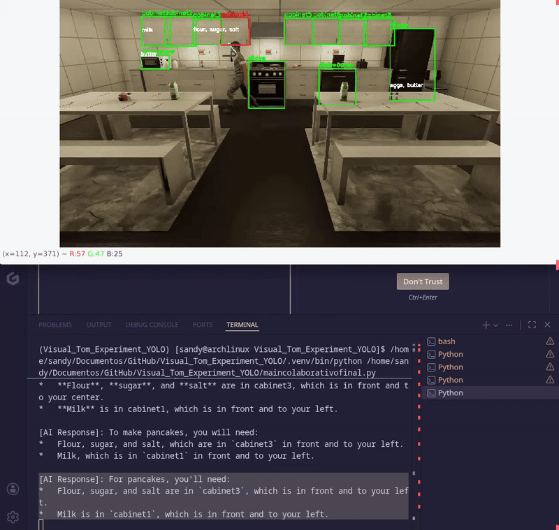

# Visual_Tom_Experiment_YOLO


This repository contains a vision-based assistive AI system designed to help users locate items in a kitchen environment. It utilizes a combination of object detection, human pose/face tracking, and Large Language Models (LLMs) to provide context-aware spatial guidance.


---

## Project Overview

The project consists of two primary scripts:

1.  **Main Assistant (`main_colaborative_with_gaze_pose.py`):** An AI-driven assistant that tracks human position to provide verbal guidance via the Gemini API.
2.  **Calibration Utility (`set_scenario_positions.py`):** A helper script to define coordinates for kitchen containers (cabinets, fridge, etc.) by drawing polygons on a video frame.

---

## Script Descriptions

### 1. Assistant AI
This script processes video feeds to track the user and their environment. It creates a "World State" that is sent to the Gemini AI to generate helpful, human-centric directions.

* **Human Tracking:** Uses **YOLOv8** for person detection and **MediaPipe** (Pose & Face) to estimate gaze direction and hand movement.
* **Interaction Logic:** Detects if a user is looking at or reaching for specific containers (TODO feature).
* **Belief Management:** Filters instructions based on what the user already knows (User Beliefs) to avoid redundant information.
* **Gemini Integration:** Uses `gemini-2.5-flash` to process spatial data and generate natural language responses.


### 2. Area Selection Utility
A utility script used to set up new "scenarios." It allows developers to visually define where objects are located in the video frame to generate the configuration dictionary. This is usefull for adapting the assistant to different layouts.

* **Functionality:**
    * **Left Click:** Add points to a polygon.
    * **Right Click:** Finish the polygon and enter the object name.
    * **Output:** Prints a dictionary of bounding boxes compatible with the main assistant.

---

## Technical Stack

| Component | Technology |
| :--- | :--- |
| **Vision Processing** | OpenCV, NumPy |
| **Object Detection** | Ultralytics YOLOv8 |
| **Human Landmarks** | MediaPipe (Pose & Face Landmarker) |
| **LLM Reasoning** | Google Gemini 2.5 Flash |

---

## How to Use

### Setup
1.  **Install dependencies:**
    ```bash
    pip install opencv-python numpy ultralytics mediapipe google-generativeai
    ```
2.  **API Key:** Set your key in the environment variables:
    ```bash
    export GEMINI_API_KEY='your_api_key_here'
    ```
3.  **Resources:** Ensure `pose_landmarker_lite.task` and `face_landmarker.task` are in the project root.

### Running the Assistant
1.  Run the main script.
2.  The system will track the user in real-time.
3.  **Press 'q'** to trigger a "User Request" (e.g., "Where are the pancake ingredients?").
4.  The AI will print a response in the console based on the current world state.
5.  **Press 'w'** to resume the video.
